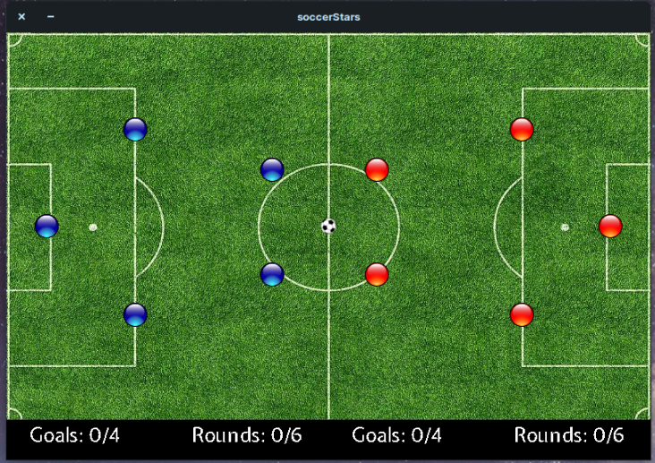
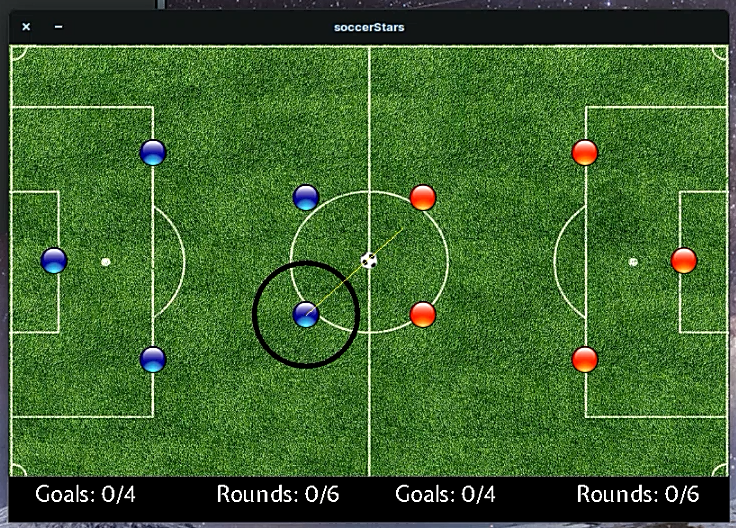

# Soccer Stars

Just a simple version of Soccer Stars Game.

## Usage

```bash
git clone https://github.com/daniyalmarofi/soccerstars.git
cd soccerstars
mkdir obj
make
./soccerStars.out
```

Enter the Number of rounds and goals required to win a game. Enjoy!

## Screenshots





